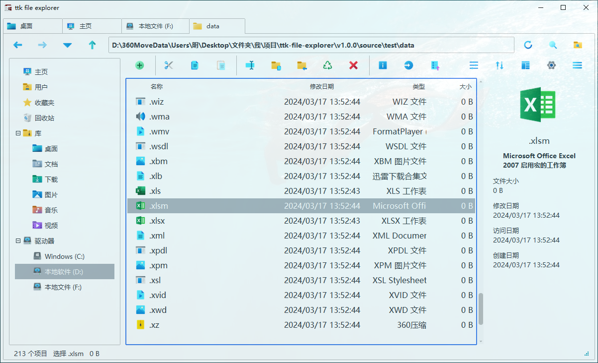
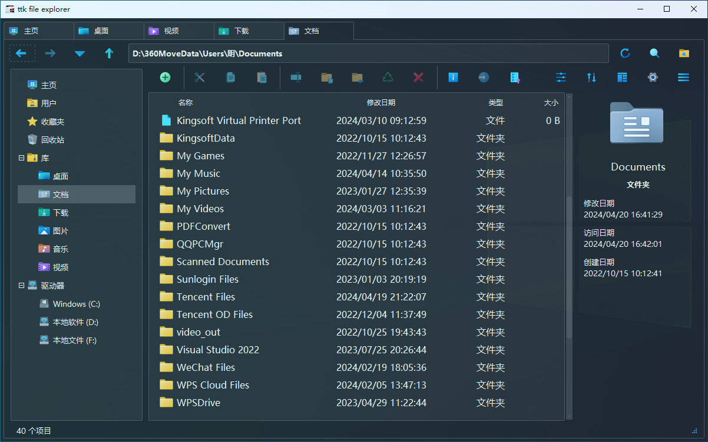

<p align="center"></p>

<p align="center">
轻量级 Windows 文件管理器
<br>
<a href="https://ttk-file-explorer.readthedocs.io/" target="_blank">主文档</a>
·
<a href="https://pyheight.github.io/ttk-file-explorer/" target="_blank">备用文档</a>
·
<a href="https://zread.ai/pyheight/ttk-file-explorer" target="_blank">AI 解读</a>  
</p>

<div align="center">  
<a href="https://github.com/pyheight/ttk-file-explorer/stargazers" target="_blank"></a>
<a href="https://github.com/pyheight/ttk-file-explorer/network/members" target="_blank"></a>

</div>  
<div align="center">  
<a href="https://github.com/pyheight/ttk-file-explorer/releases" target="_blank"></a>
<a href="https://github.com/pyheight/ttk-file-explorer/commits/main" target="_blank"></a>
<br>
<a href="https://zread.ai/pyheight/ttk-file-explorer" target="_blank"></a>
<a href="https://app.fossa.com/projects/git%2Bgithub.com%2Fpyheight%2Fttk-file-explorer?ref=badge_small" target="_blank"></a>
</div>

<br>

<p align="center">
  <a href="README_EN.md">English</a> |
  <a href="https://www.readme-i18n.com/pyheight/ttk-file-explorer?lang=de">Deutsch</a> |
  <a href="https://www.readme-i18n.com/pyheight/ttk-file-explorer?lang=es">Español</a> |
  <a href="https://www.readme-i18n.com/pyheight/ttk-file-explorer?lang=fr">Français</a> |
  <a href="https://www.readme-i18n.com/pyheight/ttk-file-explorer?lang=ja">日本語</a> |
  <a href="https://www.readme-i18n.com/pyheight/ttk-file-explorer?lang=ko">한국어</a> |
  <a href="https://www.readme-i18n.com/pyheight/ttk-file-explorer?lang=pt">Português</a> |
  <a href="https://www.readme-i18n.com/pyheight/ttk-file-explorer?lang=ru">Русский</a>
</p>

## ⚡ 介绍


*ttk file explorer* 是一款开源的、轻量的 *Windows* 文件管理器，致力于 *GUI* 打造与应用实现。

体验简洁的操作界面，依托 *tkinter* 语法和 *ttkbootstrap* 美化库，确保流畅且高效的文件操作。

## 🔥 特征

- **简洁美观** —— 现代界面设计，注重用户交互体验。
- **轻量高效** —— 快速响应，无繁琐配置，资源占用低。
- **操作便捷** —— 高效且直观的文件浏览与管理，简化使用流程。
- **自由定制** —— 自由扩展和个性化定制，提升管理效率。
- **开源免费** —— 允许用户根据需求对源代码进行修改和优化。
- **持续更新** —— 定期发布新功能和改进。

> [!IMPORTANT]
> 使用 *tkinter* 打造出惊艳的 *GUI* 应用。

## 👀 预览

| 浅色 | 深色 |
| ---- | ---- | 
|  |  |

## 🚀 开始

### 🎉 安装体验

- [Github下载](https://github.com/pyheight/ttk-file-explorer/releases/)
- [百度网盘](https://pan.baidu.com/s/1vSv-7kPXn5cRM0jjd0-qtg?pwd=2023#/home/%2F/%2F)
- [阿里云盘](https://www.aliyundrive.com/s/kooYQY65teA/)

> [!WARNING]
> 软件二次分发存在巨大安全风险，请务必通过官方渠道下载。

<details>

<summary>🚄 从源代码构建</summary>

<br>

1. **前置条件**  
> 确保已经安装了`Python 3.x`环境

2. **克隆或下载仓库**
```bash
git clone https://github.com/pyheight/ttk-file-explorer.git
```

```
https://gh.jasonzeng.dev/https://github.com/pyheight/ttk-file-explorer/archive/refs/heads/main.zip
```

```
https://github.com/pyheight/ttk-file-explorer/archive/refs/heads/main.zip
```

3. **导航到源码目录**
```bash
cd ttk-file-explorer/src
```

4. **安装依赖**
```powershell
pip install -r requirements.txt
```

```powershell
pip install -r requirements_latest.txt
```

5. **启动应用**
```bash
python main.py
```

6. **打包应用**
```bash
python script/package.py
```

</details>

## 💡 许可

**本项目根据 [Apache-2.0 license](LICENSE) 获得许可。**

> [!NOTE]
> 这意味着您可以根据 Apache-2.0 license 自由使用、修改、分发和再许可项目。

## 🙌 贡献

<a href="https://github.com/pyheight/ttk-file-explorer/graphs/contributors"></a>  

感谢每一位贡献者。

**请查阅[完整贡献指南](CONTRIBUTING.md)。**

## 📈 活跃度


---

[](https://starchart.cc/pyheight/ttk-file-explorer)
