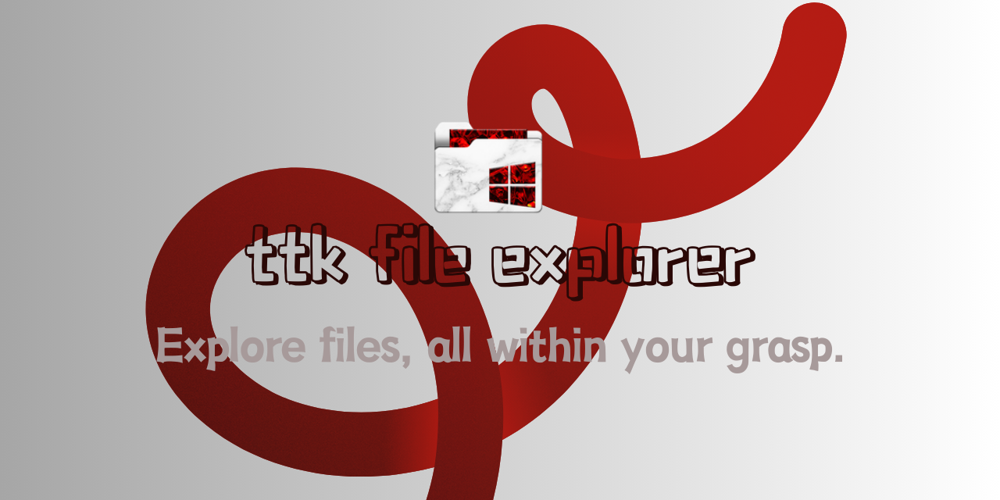
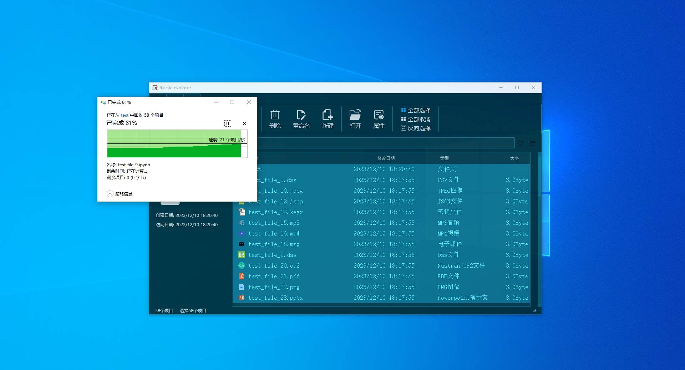

<h1 align="center">  
    
  ttk file explorer  
</h1>  

### 
<a href="README.md">简体中文</a> | <a href="README_EN.md">English</a>
 
  

  

  
  

  

  
  
  
  
  
 
 

## 简介  
ttk file explorer 是一款轻量级的文件管理器，基于**tkinter**语法和**ttkbootstrap**美化库开发。

目前专为Windows设计，旨在解决用户在文件浏览和管理等方面的痛点，提供高效、便捷的文件管理体验。

它只有最基本的功能，因此用户不会被莫名其妙的界面吓倒。通过简洁、直观且可定制的界面提供了文件管理所需的基本功能。
* 采用现代化的界面设计，注重简洁性和美感。
* 运行响应快，无配置要求，最小资源使用。
* 提供高效且直观的文件浏览和管理功能。

## 为什么这个项目有用
在如今的市场上，文件管理器种类繁多，其中不乏拥有精美Windows UI和底层高级功能的佼佼者。然而，ttk file explorer对于那些热衷于tkinter开发的创作者们来说，无疑是一个值得学习和借鉴的参考案例。

它让我们看到，只要用心设计、精心打磨，tkinter同样能够创造出令人眼前一亮的GUI应用程序。

* **特殊性**：如果不告诉你，估计没人会想到这是用tkinter开发的，因为其界面之精美、功能之完善，让人难以将其与tkinter的传统形象联系起来。
* **适用于Windows**：作为一个Windows软件，它充分利用了Windows系统的特性，提供了与操作系统紧密结合的体验。  
* **开源和免费**：作为一个开源项目，用户可以根据自己的需求进行扩展和定制，提高文件管理的灵活性和便利性。  

## 软件预览
|界面美观|极致绿色|易于使用|
|--|--|--|
||||

## 如何开始？  
### 说明
目前，您可以先行下载安装包进行初步的探索与体验，我们的源码正在进行深度的重构工作，待完成后会第一时间与大家分享。

以下是`v1.0.0`版本的界面预览图，目前正处于紧张的开发阶段，敬请各位耐心等待，相信它一定会给您带来惊喜！

|光亮样式|黑暗样式|
|--|--|
|||

### 使用  
* 支持多种文件类型，包括文本、图片、音频和视频等。通过选择文件夹和文件查看详细信息。
* 对文件和文件夹进行复制、移动、删除、重命名、新建、选择等操作，支持批量处理。
* 提供查看文件属性功能、界面皮肤修改、主题设置等实用功能。
* 请右键系统托盘图标，在退出按钮处点击，即可退出。
* 请谨慎操作，以免误删或误移动重要文件。
  
### 获得帮助  
* **文档**：本项目的GitHub仓库中包含了详细的文档和使用指南。  
* **社区支持**：您可以通过GitHub上的项目页面提出问题或寻求帮助，作者会提供支持。  
* **贡献者**：如果您熟悉`Python`和`tkinter`，并且愿意为项目做出贡献，请随时提交拉取请求或提供建议。  
  
## 欢迎贡献者  

我们非常欢迎并感激每一位贡献者。无论您是提交了一个简单的`bug`修复，还是实现了一个全新的功能，您的贡献都将得到我们和社区的尊重和认可。  
为了帮助您更好地了解如何为项目做出贡献，我们提供了一份详细的[贡献指南](CONTRIBUTING.md)。请务必遵循其中的指示，以确保您的代码能够顺利地集成到我们的项目中。  

## 目标和愿景 
* **短期目标**：优化现有功能，提高用户体验，修复已知问题。  
* **长期愿景**：将项目扩展为一个功能全面的文件管理工具，支持更多的操作系统，并建立一个活跃的社区。  
  
## 许可证和责任  

* 我们的项目使用[Apache-2.0 license](LICENSE)开源协议。
* 所有代码和文档归项目拥有者所有。
* 本软件无需联网，不会收集或存储用户的个人数据。
* 安装包二进制程序无病毒、无恶意软件，但无法保证完全符合您的预期。开发者不对任何索赔、损害赔偿或其他责任承担责任。
* 为了确保软件的安全性和稳定性，您在使用时需要遵守相关法律法规和本软件的使用协议。请勿进行违法活动或侵犯他人权益。

## 星星历史图

