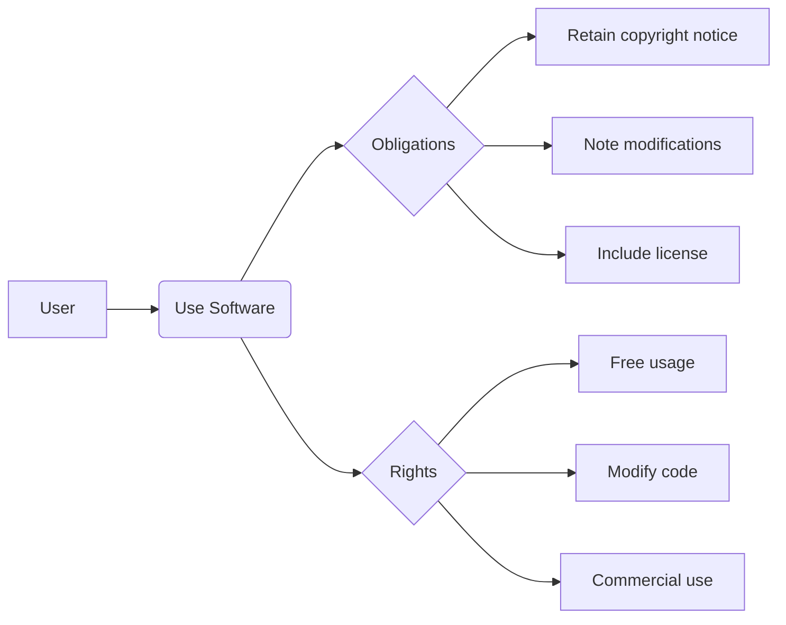

# :material-scale-balance: License

## :material-github: Open Source License

This project is licensed under the [Apache-2.0 license](https://github.com/pyheight/ttk-file-explorer/blob/main/LICENSE){ target="_blank" }.

{ target="_blank" }

This means you can:

- :material-check: **Use Freely**  
Use in personal or commercial projects at no cost.

- :material-code-braces: **Modify Code**  
Adapt source code according to your needs.

- :material-share-variant: **Distribute Software**  
Share original or modified versions.

- :material-file-document-multiple: **Sublicense**  
Grant sublicenses while complying with the license terms.

## :material-information-variant: Usage Notes

## :octicons-info-16: Important Notes

- :material-alert: **Security Warning**  
Software redistribution poses significant security risks. Always download from official channels.

- :material-shield-alert: **Disclaimer**  
Software comes with no availability guarantees. Any losses from software use are the user's responsibility.

- :material-copyright: **Copyright Notice**  
Icon resources are from the internet with copyright belonging to respective sites. Software is for learning reference only.

- :material-source-fork: **Reposting Requirements**  
Sharing this software is welcome but must include the project URL. Uncredited reposts are considered unauthorized.

---
