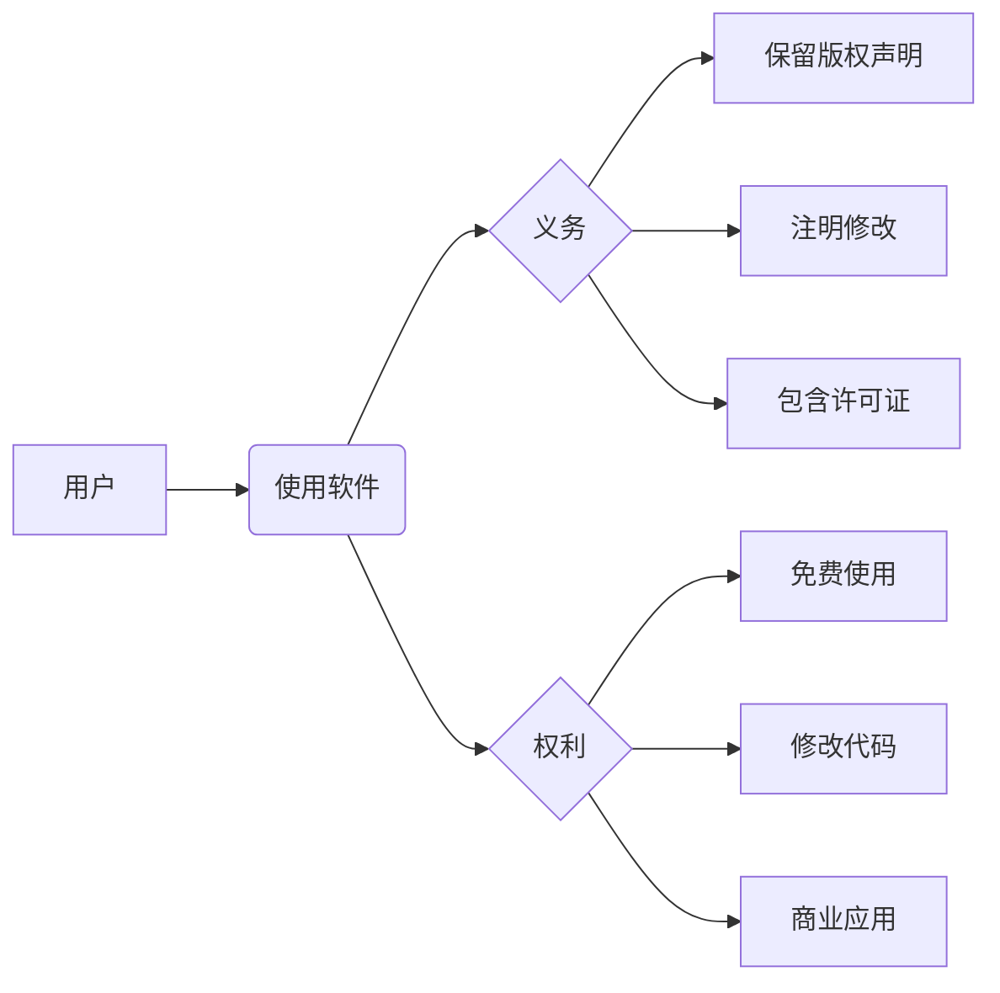

# :material-scale-balance: 许可

##  :material-github: 开源协议

本项目根据 [Apache-2.0 license](https://github.com/pyheight/ttk-file-explorer/blob/main/LICENSE){ target="_blank" } 获得许可。

这意味着您可以：

- :material-check: **自由使用**  
在个人或商业项目中免费使用。

- :material-code-braces: **修改代码**  
根据需求调整源代码。

- :material-share-variant: **分发软件**  
分享原始或修改后的版本。

- :material-file-document-multiple: **再许可**  
在遵守协议的前提下进行再授权。

## :material-information-variant: 使用须知

## :octicons-info-16: 注意事项

- :material-alert: **安全警告**  
软件二次分发存在巨大安全风险，请务必通过官方渠道下载。

- :material-shield-alert: **免责声明**  
软件不保证可用性，由于使用软件而产生的任何损失均由用户自行承担。

- :material-copyright: **版权说明**  
图标资源来自互联网，版权属于相关网站，软件仅供学习参考使用。

- :material-source-fork: **转载要求**  
欢迎转载本软件，但必须附上项目地址，未注明来源的转载行为均视为未授权。

---
