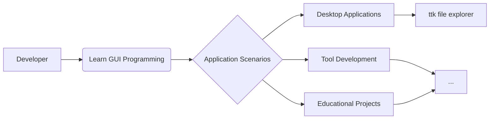

# :material-file-tree: Project Introduction

## :material-message-text: Foreword

This is the [author](../author/)'s first substantial project.  

!!! info "Suggestion"
	**Building a solid foundation is crucial** - precisely because most people are unwilling to do it, it becomes especially valuable.

## :material-web: Official Website

-   :material-github: [**GitHub Repository**](https://github.com/pyheight/ttk-file-explorer){ target="_blank" }

    ---

    Access the latest source code, submit issues, and participate in development.

-   :material-book-open-variant: [**Main Documentation Site (Recommended)**](https://ttk-file-explorer.readthedocs.io/en/)

    ---

    Stable and reliable documentation site, which may load slowly.

-   :material-book-open-page-variant: [**Backup Documentation Site**](https://pyheight.github.io/ttk-file-explorer/en/)

    ---

    GitHub Pages mirror site, access may be limited.

-   :material-toolbox: [**Website Framework**](https://github.com/squidfunk/mkdocs-material){ target="_blank" }  

    ---

    This website is made with MkDocs Material.

???+ tip "Tip"
    Both documentation sites are completely synchronized and hosted on [GitHub](https://github.com/pyheight/ttk-file-explorer/tree/main/docs){ target="_blank" }, receiving real-time updates.

## :material-lightbulb-on: Project Philosophy

!!! quote "Why develop a file manager?"
    While seemingly basic, a file manager is the perfect practice for **core operating system components**. 

    Through this project:

    - :material-school: Deeply understand core GUI programming concepts
    - :material-puzzle: Master complex UI component interaction design
    - :material-rocket: Explore the limits of Python desktop applications

## :material-star-shooting: Core Advantages

| Advantage | Description |
|------|------|
| :material-star-face: **Elegant Simplicity** | Modern interface built with ttkbootstrap, leaving behind traditional tkinter's dated appearance |
| :material-lightning-bolt: **Lightweight Efficiency** | Extremely low resource consumption, runs smoothly even on older hardware |
| :material-github: **Fully Open Source** | [Apache-2.0 license](https://github.com/pyheight/ttk-file-explorer/blob/main/LICENSE){ target="_blank" } guarantees freedom to use and modify |
| :material-book-open: **Educational Value** | Programming enthusiasts can learn complete GUI development workflows from the source code |

## :material-alert: Current Limitations

- :octicons-package-24: **Platform Constraints**  
Currently only supports Windows due to underlying API dependencies.

- :octicons-beaker-24: **Functional Limitations**  
Not intended to fully replace system file managers; positioned as a development reference case.

## :material-comment-question: Communication & Interaction
- :material-update: [View Project Vision](../../development/roadmap/)

- :material-hand-heart: [Participate in Development](../../community/contribution-guide/)

- :material-bug: [Submit Any Questions, Suggestions, or Ideas](../../community/issue-reporting/)

!!! tip "Tip"
	Every great project begins with a simple idea and unwavering determination. Let's explore more possibilities together!
