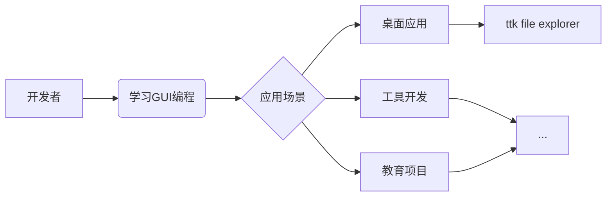

# :material-file-tree: 项目介绍

## :material-message-text: 前言

这是[作者](../author/)的第一个真正意义上的项目。  

!!! info "建议"
	**打好基础至关重要**——正因为大多数人不愿去做，它才显得尤为珍贵。

## :material-lightbulb-on: 项目理念

!!! quote "为什么开发文件管理器？"
    虽然看似基础，但文件管理器是**操作系统核心组件**的完美实践。 

    通过这个项目：

    - :material-school: 深入理解GUI编程核心概念
    - :material-puzzle: 掌握复杂界面组件交互设计
    - :material-rocket: 探索Python桌面应用的极限

## :material-star-shooting: 核心优势

| 优势 | 描述 |
|------|------|
| :material-star-face: **简洁优雅** | 采用 ttkbootstrap 打造的现代化界面，告别传统 tkinter 的陈旧外观 |
| :material-lightning-bolt: **高效轻量** | 极低的资源占用，在老旧设备上也能流畅运行 |
| :material-github: **完全开源** | [Apache-2.0 license](https://github.com/pyheight/ttk-file-explorer/blob/main/LICENSE) 保障自由使用和修改 |
| :material-book-open: **学习价值** | 编程爱好者可从源码中学习完整 GUI 开发流程 |

## :material-alert: 当前限制

- :octicons-package-24: **平台限制**  
目前仅支持 Windows 系统，因底层 API 依赖。

- :octicons-beaker-24: **功能限制**  
无法完全替代系统文件管理器，定位为开发参考案例。

## :material-comment-question: 交流互动

- :material-update: [查看项目愿景](../../development/roadmap/)

- :material-hand-heart: [参与开发](../../community/contribution-guide/)

- :material-bug: [提出任何问题、建议或想法](../../community/issue-reporting/)

!!! tip "提示"
	每个伟大的项目都始于一个简单的想法和坚定的决心。让我们一起探索更多可能！
