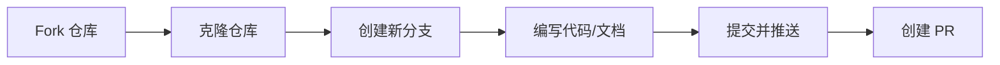

# :material-hand-heart: 贡献指南

## :material-account-group: 贡献者墙

<a href="https://github.com/pyheight/ttk-file-explorer/graphs/contributors">

</a>
  
!!! success "感谢每一位贡献者"
    :material-emoticon-happy-outline: 您的参与让 ttk file explorer 变得更好！  

## :material-account-supervisor: 成为贡献者

1. :material-git: **提交 PR**  
	您的 PR 被合并后
  
2. :material-account-plus: **加入名单**    
	成为官方贡献者
  
3. :material-trophy: **展示成就**  
	列入贡献者墙

## :material-source-fork: 贡献方式

<div class="grid cards" markdown>

- :material-bug: **报告问题或建议**  
	在 GitHub 创建 Issue · 提供详细描述 · 包含相关环境信息  

- :material-file-document: **文档贡献**  
	修改 Markdown 文件 · 更正错误，提升质量 · 更新功能描述和指南  

- :material-code-braces-box: **代码贡献**  
	选择现有问题或新功能 · 遵循 PEP8 编码规范 · 创建 Pull Request 

- :material-git: **其他贡献**    
	即使是小贡献也很重要！任何修正和改进都值得赞赏。

</div>

## :material-road-variant: 开始步骤



1. :material-source-fork: **Fork 仓库**  
> 访问 GitHub 仓库并点击`Fork`按钮

2. :material-content-copy: **克隆仓库**  
```bash
git clone https://github.com/pyheight/ttk-file-explorer.git
cd ttk-file-explorer
```

3. :material-source-branch: **创建新分支**  
```bash
git checkout -b feature/your-feature-name
```

4. :material-pencil: **编写代码或文档**  
> 代码修改在`src/`目录  
> 文档修改在`docs/`目录

5. :material-upload: **提交并推送**  
```bash
git add .
git commit -m "描述您的更改"
git push origin feature/your-feature-name
```

6. :material-source-pull: **创建 PR**  
> 在 GitHub 仓库页面点击`New Pull Request`按钮

## :material-book-open: 贡献规范  

<div class="grid cards" markdown>

- :material-code-tags-check: **编码风格**  
	遵循 PEP8 规范。

- :material-text-box: **文档要求**  
	所有新功能需附带文档。

- :material-flask: **测试要求**  
	核心功能需包含单元测试。

- :material-message-text: **提交信息**  
	清晰描述变更内容。

</div>

## :material-link: 更多参考

- :material-file-document: [完整贡献指南](https://github.com/pyheight/ttk-file-explorer/blob/main/CONTRIBUTING.md)

- :material-lightbulb: [Good First Issues](https://forgoodfirstissue.github.com)

- :material-bug: [提出任何问题、建议或想法](../issue-reporting/)

!!! tip "提示"
	:material-handshake: 期待您的贡献！ 
