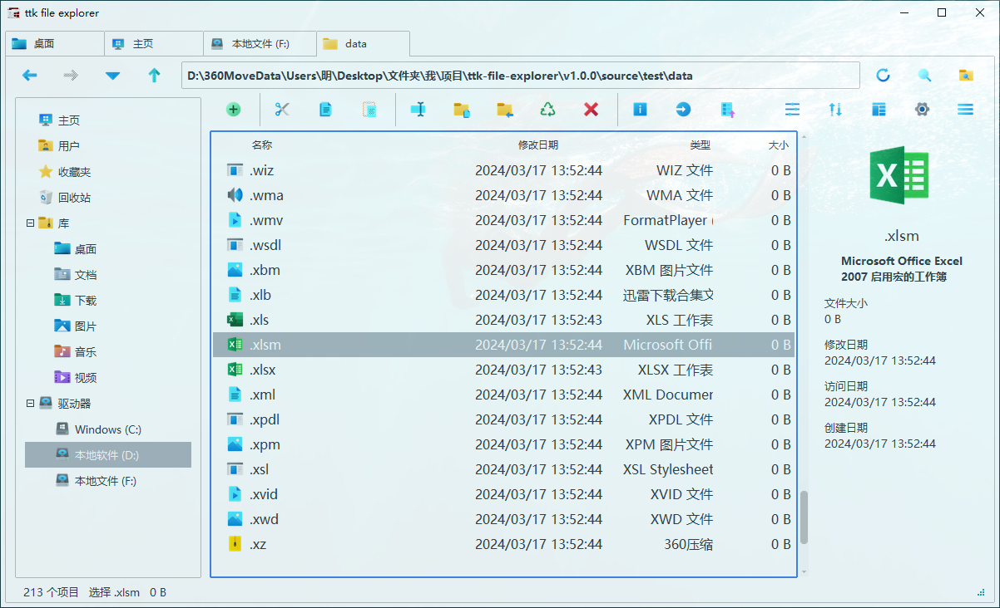
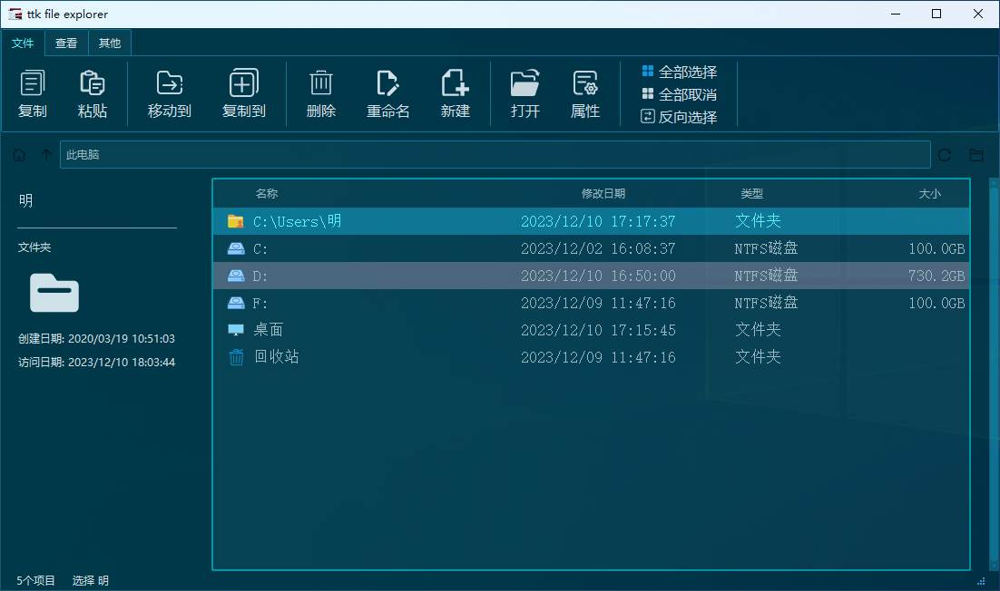

# :material-image-multiple: Gallery

## :material-package-variant: v1.0.0-beta

-   :material-white-balance-sunny: **Light Mode**

    ---

    { loading=lazy }
    
-   :material-weather-night: **Dark Mode**

    ---

    { loading=lazy }

-   :material-rocket-launch: **Splash Screen**

    ---

    { loading=lazy }

## :material-package-variant: v0.3.0-beta

-   :material-progress-download: **Loading Screen**

    ---

    { loading=lazy }
    
-   :material-monitor-dashboard: **Main Interface**

    ---

    { loading=lazy }
    
-   :material-file-image: **File Icons**

    ---

    { loading=lazy }

-   :material-file-multiple: **File Selection**

    ---

    { loading=lazy }

-   :material-menu-open: **Selected Menu**

    ---

    { loading=lazy }

-   :material-menu-close: **Unselected Menu**

    ---

    { loading=lazy }
    
-   :material-delete: **File Deletion**

    ---

    { loading=lazy }

## :material-package-variant: v0.2.0-beta

-   :material-progress-clock: **Loading Screen**

    ---

    { loading=lazy }

-   :material-desktop-classic: **Main Interface**

    ---

    { loading=lazy }

-   :material-format-font: **Font Selection**

    ---

    { loading=lazy }

-   :material-view-grid: **Custom Layout**

    ---

    { loading=lazy }

-   :material-palette: **Custom Theme Colors**

    ---

    { loading=lazy }

-   :material-puzzle: **Component Examples**

    ---

    { loading=lazy }

