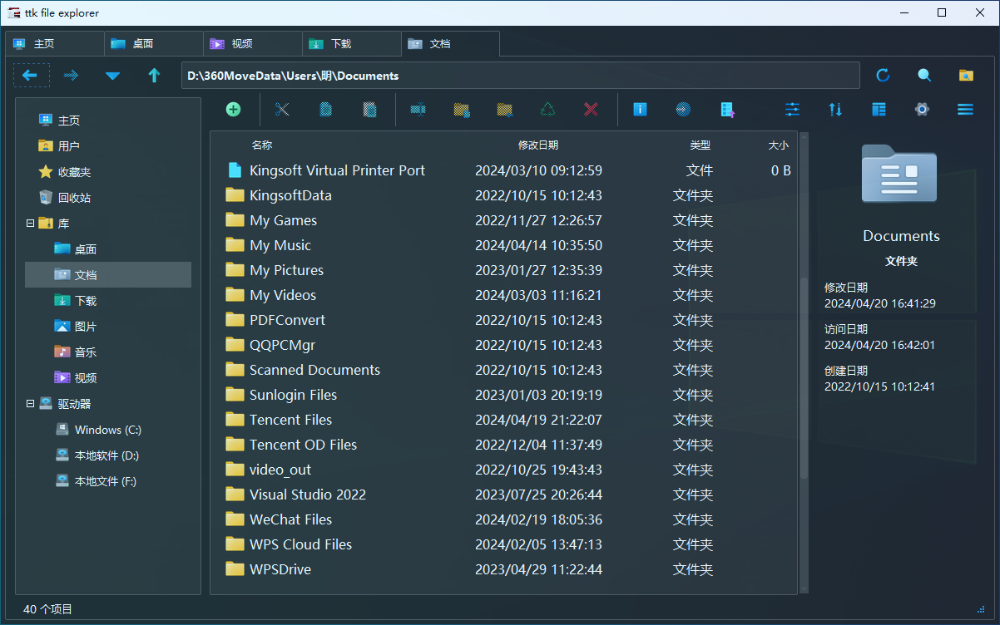

# :material-image-multiple: 画廊

## :material-package-variant: v1.0.0-beta

-   :material-white-balance-sunny: **明亮模式**

    ---

    { loading=lazy }
    
-   :material-weather-night: **暗黑模式**

    ---

    { loading=lazy }

-   :material-rocket-launch: **启动画面**

    ---

    { loading=lazy }

## :material-package-variant: v0.3.0-beta

-   :material-progress-download: **加载界面**

    ---

    { loading=lazy }
    
-   :material-monitor-dashboard: **主界面**

    ---

    { loading=lazy }
    
-   :material-file-image: **文件图标**

    ---

    { loading=lazy }

-   :material-file-multiple: **文件选择**

    ---

    { loading=lazy }

-   :material-menu-open: **选中菜单**

    ---

    { loading=lazy }

-   :material-menu-close: **未选中菜单**

    ---

    { loading=lazy }
    
-   :material-delete: **文件删除**

    ---

    { loading=lazy }

## :material-package-variant: v0.2.0-beta

-   :material-progress-clock: **加载界面**

    ---

    { loading=lazy }

-   :material-desktop-classic: **主界面**

    ---

    { loading=lazy }

-   :material-format-font: **字体选择**

    ---

    { loading=lazy }

-   :material-view-grid: **自定义布局**

    ---

    { loading=lazy }

-   :material-palette: **自定义主题颜色**

    ---

    { loading=lazy }

-   :material-puzzle: **组件示例**

    ---

    { loading=lazy }

