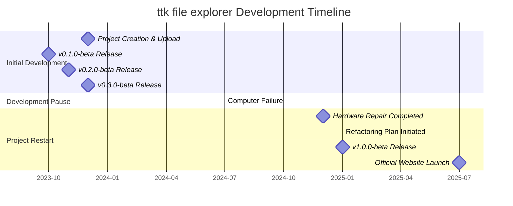

# :material-calendar-check: Milestones

```mermaid
gantt
    title ttk file explorer Development Timeline
    dateFormat  YYYY-MM
    axisFormat  %Y-%m
    
    section Initial Development
    Project Creation & Upload     :milestone, 2023-12, 0d
    v0.1.0-beta Release   :milestone, 2023-10, 0d
    v0.2.0-beta Release   :milestone, 2023-11, 0d
    v0.3.0-beta Release   :milestone, 2023-12, 0d
    
    section Development Pause
    Computer Failure       :crit, 2024-07, 4m
    
    section Project Restart
    Hardware Repair Completed       :milestone, 2024-12, 0d
    Refactoring Plan Initiated       :active, 2025-01, 12m
    v1.0.0-beta Release   :milestone, 2025-01, 0d
    Official Website Launch   :milestone, 2025-07, 0d
```
