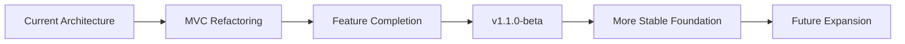
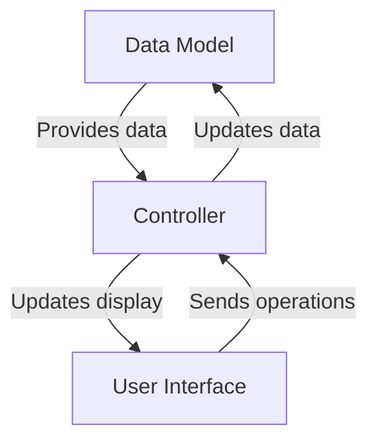

# :material-map-marker-path: Roadmap

## :octicons-versions-24: Planned Versions

Coming soon: `v1.1.0-beta`

## :material-vector-square: Architecture Refactoring

- Model Layer: Separates data management and business logic

- View Layer: Focuses on UI presentation and user interaction

- Controller Layer: Coordinates interaction between Model and View

!!! info "Core Objective"
	**Implement a true MVC architecture.**

## :material-puzzle-check: Feature Enhancement Plan

- **File Operations Enhancement**  
:material-progress-check: Advanced copy/move operations
:material-progress-check: Search functionality optimization

- **UI Effects Optimization**  
:material-progress-check: Custom layout presets
:material-progress-check: Custom themes

- **System Integration**  
:material-progress-check: Complete context menu
:material-progress-check: Navigation optimization
:material-progress-check: Customizable shortcuts

## :material-calendar-clock: Timeline Planning

!!! info "Development Windows"
	Considering academic commitments, main development will occur during:

	- :material-sun-snowflake: Winter break (January-February)
	- :material-sun-thermometer: Summer break (July-August)

	Occasional development and maintenance will continue during other periods.

## :material-progress-question: Participation Methods

- :material-code-braces: **Development Assistance**  
Contributions welcome from developers familiar with MVC architecture.

- :material-bug: **Testing & Feedback**  
Experience beta versions and report issues.

- :material-lightbulb-on: **Feature Suggestions**  
Share ideas for file manager needs.

