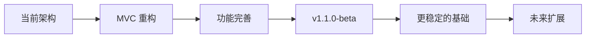
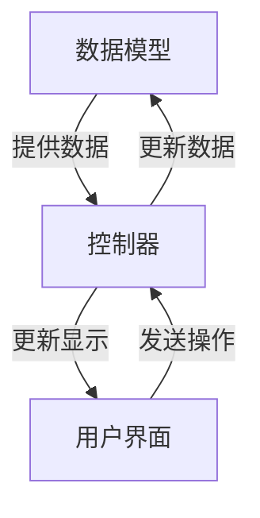

# :material-map-marker-path: 开发计划

## :octicons-versions-24: 计划版本

即将到来：`v1.1.0-beta`

## :material-vector-square: 架构重构

- 模型层(Model)：分离数据管理和业务逻辑

- 视图层(View)：专注 UI 呈现和用户交互

- 控制层(Controller)：协调模型和视图之间的交互

!!! info "核心目标"
	**实现真正的 MVC 架构。**

## :material-puzzle-check: 功能完善计划

 

- **文件操作增强**  
:material-progress-check: 高级复制/移动操作 :material-progress-check: 搜索功能优化

- **界面效果优化**  
:material-progress-check: 自定义布局预设
:material-progress-check: 自定义主题

- **系统集成**  
:material-progress-check: 完善右键菜单
:material-progress-check: 导航功能优化
:material-progress-check: 快捷键自定义

## :material-calendar-clock: 时间规划

!!! info "开发窗口"
	考虑到学业安排，主要开发工作将在以下时间段进行：

	- :material-sun-snowflake: 寒假期间 (1月-2月)
	- :material-sun-thermometer: 暑假期间 (7月-8月)

	其余时间将进行零星的开发和维护工作。

## :material-progress-question: 参与方式

 

- :material-code-braces: **开发协助**  
欢迎熟悉 MVC 架构的开发者参与贡献。

- :material-bug: **测试反馈**  
体验测试版并报告问题。

- :material-lightbulb-on: **功能建议**  
分享对文件管理器的需求想法。

---
