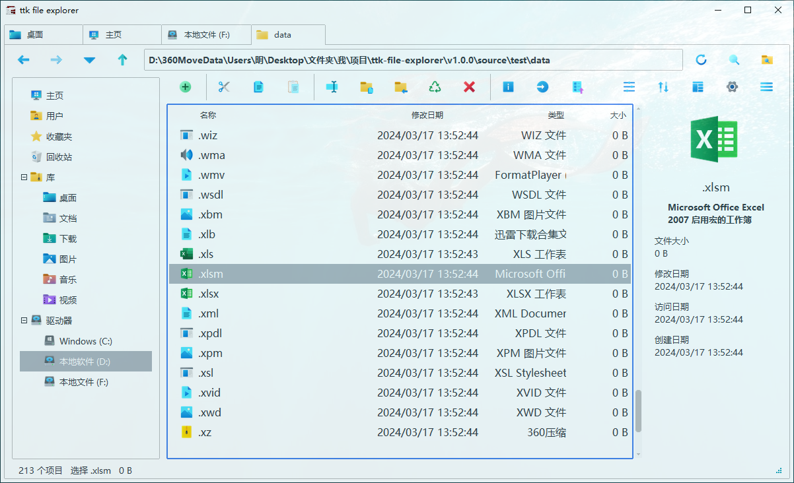

---
hide:
  - navigation
  - toc
  - footer
hide_actions: true
hide_anchor: true
---

# :octicons-file-directory-open-fill-24: ttk file explorer

  

  

  

  

<h3>一款开源的、轻量的 <i>Windows</i> 文件管理器，致力于 <i>GUI</i> 打造与应用实现。</h3>

  
不一样的文件管理器

  

        
    

      体验简洁的操作界面，依托 <em>tkinter</em> 语法和 <em>ttkbootstrap</em> 美化库，确保流畅且高效的文件操作。
    

  

[:material-rocket-launch: 快速使用](./download/installation/#_3){: .md-button .md-button--primary }
[:material-dots-horizontal-circle: 了解更多](./about/project-overview/){: .md-button }

## :octicons-eye-24: 预览

  

    

      

        
      

      
浅色主题

    

    

      

        
      

      
深色主题

    

  

## :material-star-shooting-outline: 核心优势

- :material-star-face:{ .lg .middle } __简洁美观__  
现代界面设计，注重用户交互体验。

- :material-lightning-bolt:{ .lg .middle } __轻量高效__  
快速响应，无繁琐配置，资源占用低。

- :material-folder-multiple:{ .lg .middle } __操作便捷__  
高效且直观的文件浏览与管理，简化使用流程。

- :material-palette:{ .lg .middle } __自由定制__  
自由扩展和个性化定制，提升管理效率。

- :material-github:{ .lg .middle } __开源免费__  
允许用户根据需求对源代码进行修改和优化。

- :material-update:{ .lg .middle } __持续更新__  
定期发布新功能和改进。

## :octicons-graph-16: 项目活跃度

  

    
  

  
  

  
  

    
  

---

:material-heart-outline: 
:material-heart-half-full: 
:material-heart: 
Made with Love 
:material-heart: 
:material-heart-half-full: 
:material-heart-outline:

